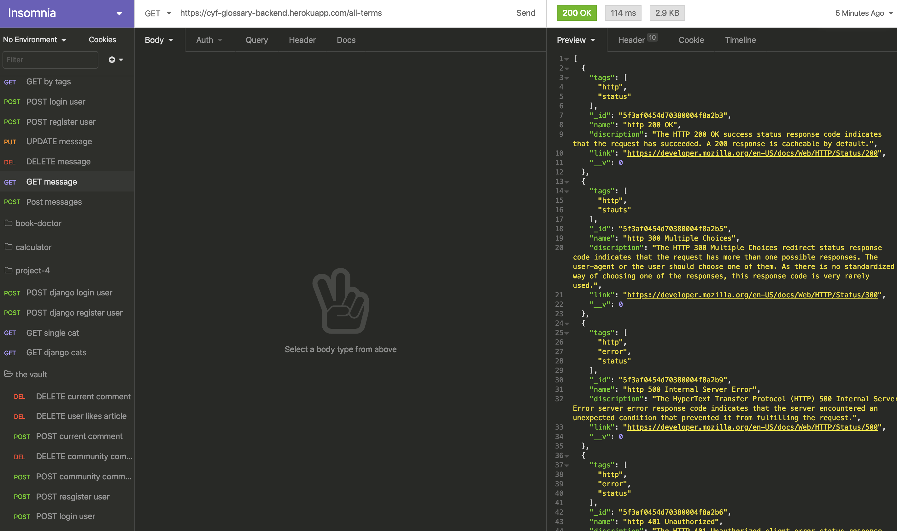

# CYF-glossary-backend

## All available end points

### GET - Read all the terms
* https://cyf-glossary-backend.herokuapp.com/all-terms

### POST - Create a term 
* https://cyf-glossary-backend.herokuapp.com/all-terms

### GET - Read a single term
* https://cyf-glossary-backend.herokuapp.com/all-terms/:id

### PUT - Update a term 
* https://cyf-glossary-backend.herokuapp.com/all-terms/:id

### DELETE - Remove a term
* https://cyf-glossary-backend.herokuapp.com/all-terms/:id

### GET - Find terms by Tags
* https://cyf-glossary-backend.herokuapp.com/tags/:id

---

## Before calling the API

1. Please note that all the endpoints are open to public. As there is no user authentication feature. The terms you created may be deleted or updated by other users.

2. Anyone may create new terms. No sign in requried.

---

## Before creating a term

1. Please be careful about the fields set up in the server. We currently have *names*, *description*, *link* and *tags* fields. Though this can be modified while our application grows.

2. If you create a term with fields that is not include in the server schema, it will then not be saved into the database.

3. To check out *current available fields* and the *type of data* you should enter when POST a new term. Go to backend -> models -> Terms.js

4. There are certain fields that are required and they must be unique, please check the schema in backend/models/Terms.js before creating a term.

---

## Seeds

1. We also created seeds in the database. So you have a few terms to start with. The seeds data contains *names*, *description*, *link* and *tags*

2. Check it out at backend/db/seeds.js and backend/db/userSeeds.js

---

## Endpoints on Insomnia

